# Procurement System Technical Specification

## Table of Contents
- [1. System Architecture](#1-system-architecture)
  - [1.1. Monorepo Structure](#11-monorepo-structure)
  - [1.2. Service Architecture](#12-service-architecture)
  - [1.3. Data Flow](#13-data-flow)
- [2. Frontend Applications](#2-frontend-applications)
  - [2.1. Shared UI Components](#21-shared-ui-components)
  - [2.2. Application-Specific Features](#22-application-specific-features)
- [3. Backend Services](#3-backend-services)
  - [3.1. Service Definitions](#31-service-definitions)
  - [3.2. API Design](#32-api-design)
  - [3.3. Database Schema](#33-database-schema)
- [4. Authentication & Authorization](#4-authentication--authorization)
  - [4.1. Authentication Flow](#41-authentication-flow)
  - [4.2. RBAC Implementation](#42-rbac-implementation)
- [5. Payment Integration](#5-payment-integration)
  - [5.1. Stripe Implementation](#51-stripe-implementation)
  - [5.2. Commission Handling](#52-commission-handling)
- [6. Observability & Monitoring](#6-observability--monitoring)
- [7. Deployment Architecture](#7-deployment-architecture)
- [8. Technical Implementation Details](#8-technical-implementation-details)
- [9. Testing Strategy](#9-testing-strategy)
- [10. Security Considerations](#10-security-considerations)

## 1. System Architecture

### 1.1. Monorepo Structure

The procurement system will be implemented as a Turborepo monorepo with the following high-level structure:

```
procurement-platform/
├── apps/
│   ├── admin-ui/         # Admin frontend application
│   ├── client-ui/        # Client frontend application 
│   ├── supplier-ui/      # Supplier frontend application
│   └── auth-ui/          # Shared authentication UI components
├── services/
│   ├── auth-service/     # Authentication & user management
│   ├── user-service/     # User profiles and permissions
│   ├── procurement-service/ # Request creation and management
│   ├── bidding-service/  # Bid submission and management
│   ├── billing-service/  # Subscription and payment processing
│   ├── analytics-service/ # Reporting and analytics
│   ├── notification-service/ # Email and push notifications
│   └── geolocation-service/ # Map and location services
├── packages/
│   ├── ui/               # Shared UI components
│   ├── api-client/       # Generated API client
│   ├── tsconfig/         # Shared TypeScript configurations
│   ├── eslint-config/    # Shared ESLint configurations
│   └── utils/            # Shared utility functions
└── infrastructure/       # IaC templates and deployment scripts
```

### 1.2. Service Architecture

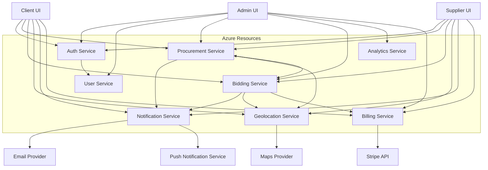

### 1.3. Data Flow

Below is a sequence diagram showing the flow for a typical procurement request lifecycle:

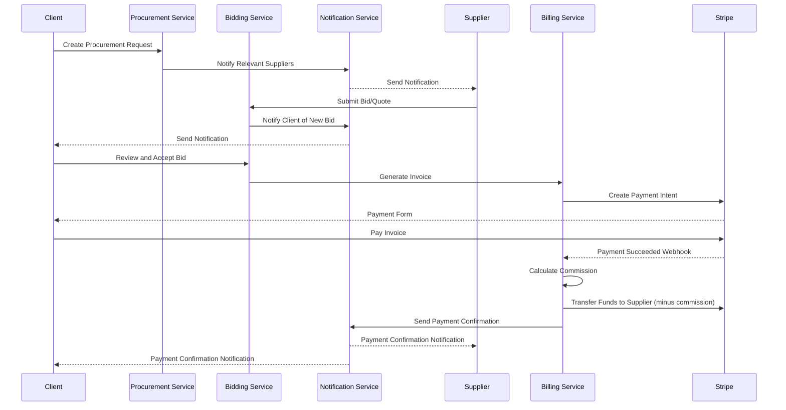

## 2. Frontend Applications

The system consists of three distinct frontend applications targeting different user roles:

### 2.1. Shared UI Components

All frontend applications will use shadcn/ui for a consistent, glassmorphic UI with the following shared components:

- Design System
  - Typography system
  - Color system with light/dark mode support
  - Spacing system
  - Component library
- Authentication UI (shared via auth-ui app)
- Form components
- Data tables
- Charts and data visualization
- Notification system
- Chat components

### 2.2. Application-Specific Features

#### Admin UI

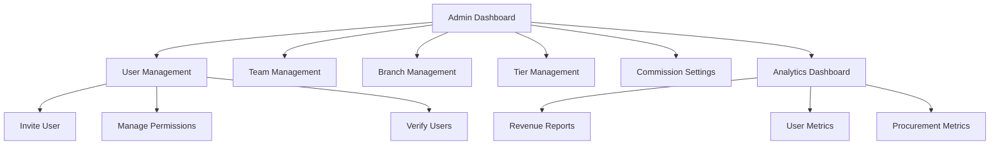

Key features:
- User and team management
- Branch management
- Tier and subscription configuration
- Commission management
- Platform analytics
- Verification management

#### Client UI

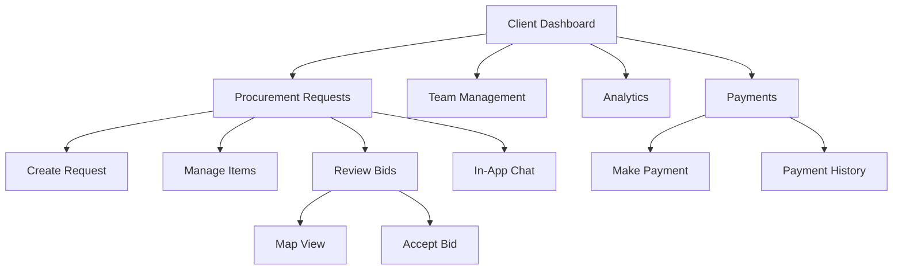

Key features:
- Team and user management
- Procurement request creation and management
- Item management within requests
- Bid review and acceptance
- In-app chat with suppliers
- Map visualization of suppliers and delivery locations
- Direct payment to suppliers via Stripe

#### Supplier UI

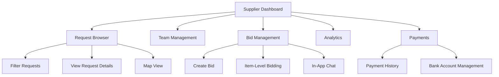

Key features:
- Team and user management
- Request browsing and filtering
- Bid creation and management
- Item-level bidding
- In-app chat with clients
- Map visualization of delivery locations
- Payment reception and management

## 3. Backend Services

### 3.1. Service Definitions

#### Auth Service
- User authentication via email/password and SSO integrations
- MFA support
- Session management
- Integrates with Clerk for authentication flows

#### User Service
- User profile management
- Company profile management
- Role-based access control
- Team and branch management

#### Procurement Service
- Procurement request creation and management
- Item management within requests
- Request workflow (draft, published, in-progress, completed)
- Request metadata management

#### Bidding Service
- Bid submission and management
- Item-level bid management
- Bid status tracking
- Bid acceptance flow
- Bid-credit consumption tracking

#### Billing Service
- Subscription management
- Invoice generation
- Payment processing
- Commission calculation and distribution
- Subscription tier enforcement
- Bid-credit management

#### Analytics Service
- Reporting and dashboards
- User activity tracking
- Spend analytics
- Supplier performance metrics
- Platform health metrics

#### Notification Service
- Email notifications
- In-app notifications
- Push notifications
- Notification preferences
- Scheduled notifications

#### Geolocation Service
- Address validation and geocoding
- Distance calculation
- Map data management
- Location-based supplier recommendations

### 3.2. API Design

All services will expose REST APIs following these conventions:

- Resource-oriented endpoints
- JSON request/response bodies
- JWT authentication
- Versioned API paths (e.g., `/api/v1/resource`)
- Consistent error responses
- OpenAPI/Swagger documentation

Example API structure for Procurement Service:
```
GET    /api/v1/procurement/requests
POST   /api/v1/procurement/requests
GET    /api/v1/procurement/requests/{id}
PUT    /api/v1/procurement/requests/{id}
DELETE /api/v1/procurement/requests/{id}
GET    /api/v1/procurement/requests/{id}/items
POST   /api/v1/procurement/requests/{id}/items
```

### 3.3. Database Schema

The system will use PostgreSQL for relational data. Key entities include:

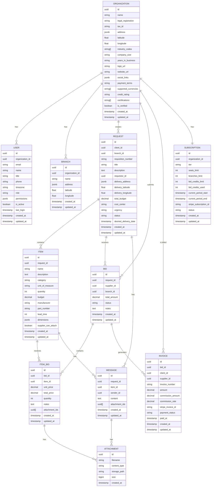

## 4. Authentication & Authorization

### 4.1. Authentication Flow

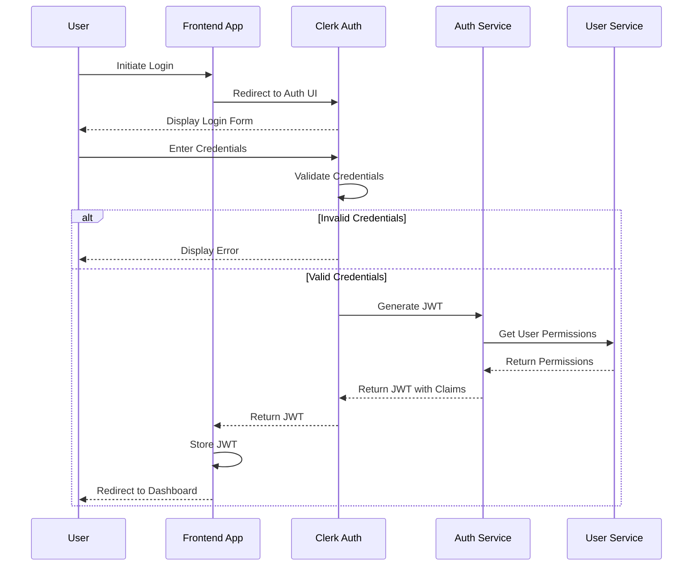

### 4.2. RBAC Implementation

Role-based access control will be implemented at multiple levels:

1. **JWT Claims**: User roles and high-level permissions encoded in JWT
2. **API Gateway**: Basic role validation at the gateway level
3. **Service-Level**: Fine-grained permission checks within each service
4. **UI Components**: Conditional rendering based on permissions

Permission structure will be hierarchical:
```
{
  "organization_id": "org_123",
  "role": "admin",
  "permissions": {
    "users": {
      "create": true,
      "read": true,
      "update": true,
      "delete": true
    },
    "requests": {
      "create": true,
      "read": true,
      "update": true,
      "delete": true,
      "approve": true
    },
    ...
  },
  "branches": ["branch_1", "branch_2"]
}
```

## 5. Payment Integration

### 5.1. Stripe Implementation

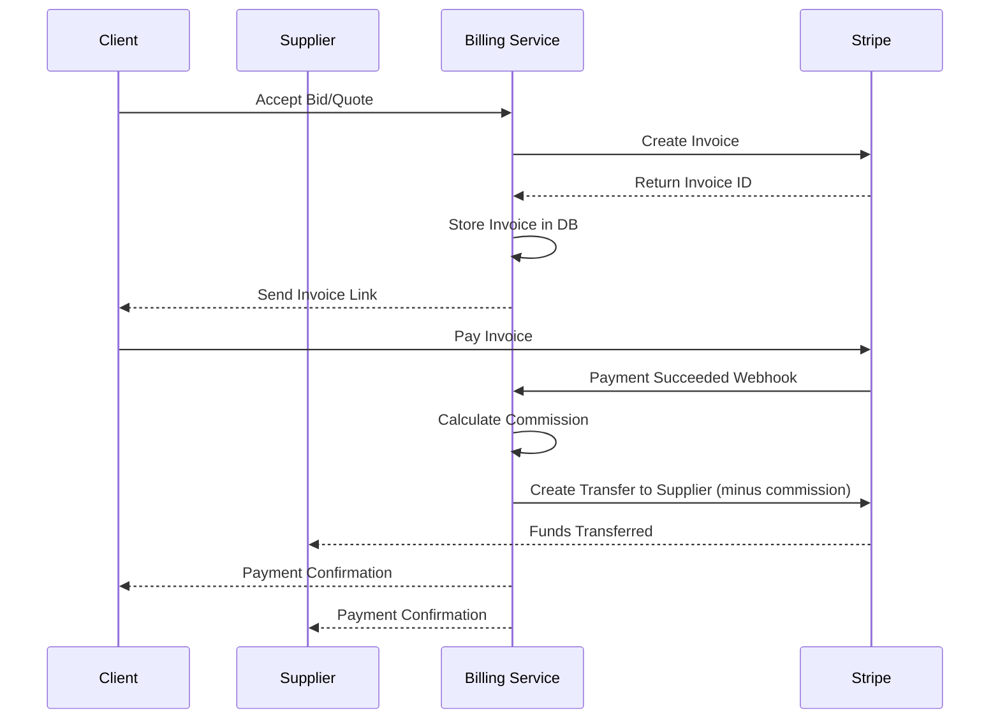

### 5.2. Commission Handling

Commission calculation logic:
1. Base commission rate: 5%
2. Tiered volume discounts based on transaction history
3. Commission is deducted automatically before transferring funds to supplier
4. Commission reports available to both suppliers and platform admins

## 6. Observability & Monitoring

The system will implement a comprehensive observability stack:

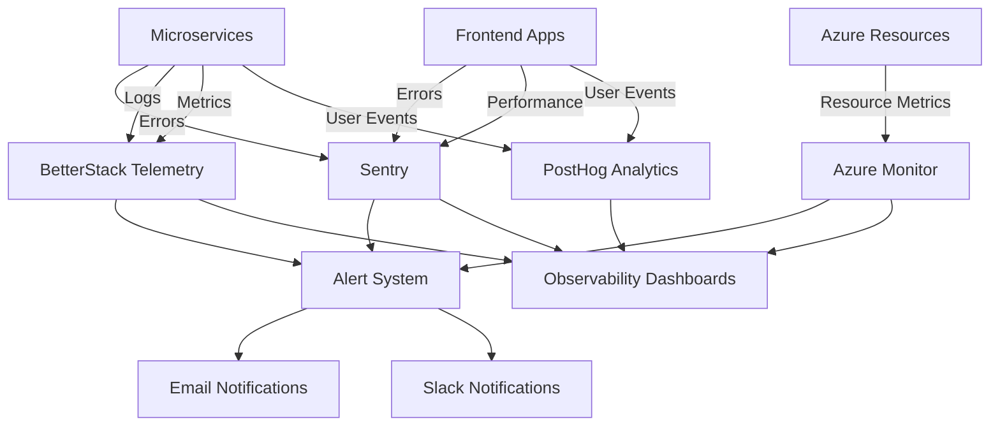

Key metrics to monitor:
- Error rates by service and endpoint
- API latency and throughput
- Database query performance
- Message queue length and processing time
- User engagement and conversion metrics
- Subscription and revenue metrics
- Infrastructure resource utilization

## 7. Deployment Architecture

The system will be deployed on Azure using the following components:

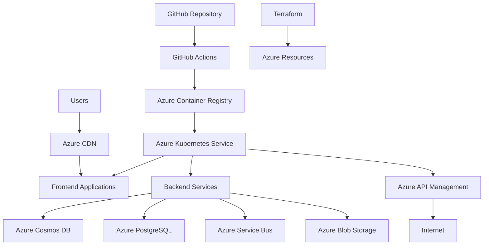

Deployment strategy:
- Containerized services deployed to AKS
- Blue/Green deployment for zero-downtime updates
- Infrastructure as Code using Terraform
- Automated CI/CD pipeline via GitHub Actions
- Environment promotion: Dev → Staging → Production

## 8. Technical Implementation Details

### Next.js & React Implementation

For frontend applications using Next.js 14 and React 19:

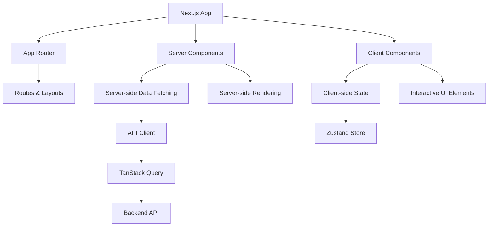

Key implementation details:
- Use React Server Components for data-fetching and initial rendering
- Use Client Components for interactive elements
- Implement Zustand for client-side state management
- Use TanStack Query for data fetching and caching
- Implement partial prerendering for optimal performance

### Microservice Implementation

Each microservice will follow this structure:

```
service-name/
├── src/
│   ├── api/             # API routes and handlers
│   ├── domain/          # Domain logic and models
│   ├── infrastructure/  # External dependencies and adapters
│   ├── repositories/    # Data access layer
│   └── services/        # Business logic
├── test/                # Test files
├── Dockerfile           # Container definition
├── package.json         # Dependencies and scripts
└── tsconfig.json        # TypeScript configuration
```

Implementation guidelines:
- Use TypeScript for type safety
- Implement dependency injection for testability
- Use repository pattern for data access
- Implement circuit breakers for external dependencies
- Use structured logging
- Implement proper error handling and status codes

## 9. Testing Strategy

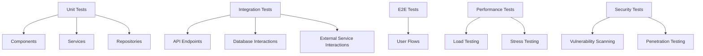

Test coverage requirements:
- Unit test coverage: 80%+ for critical business logic
- Integration test coverage: 70%+ for API endpoints
- E2E test coverage: All critical user flows
- Performance tests: Regular load and stress testing
- Security tests: Regular vulnerability scanning and penetration testing

## 10. Security Considerations

Security measures to implement:

1. **Authentication & Authorization**
   - JWT-based authentication with short expiry
   - Role-based access control
   - Multi-factor authentication
   - IP-based restrictions for admin access

2. **Data Protection**
   - Encryption at rest and in transit
   - PII data masking in logs
   - Data classification and access controls
   - Regular security audits

3. **API Security**
   - Rate limiting
   - CORS policies
   - Input validation
   - Output sanitization
   - API key management

4. **Infrastructure Security**
   - Network security groups
   - Private VNets for sensitive services
   - Regular security patching
   - Immutable infrastructure
   - Infrastructure as Code security scanning

5. **Compliance**
   - GDPR compliance
   - SOC 2 compliance
   - Regular security training for developers
   - Security incident response plan
